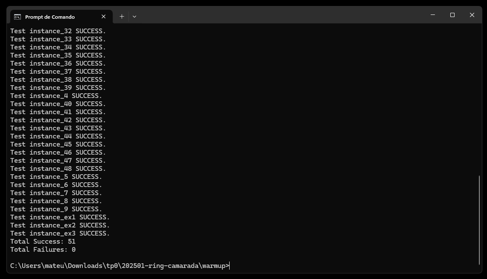

# Ring Camarada

## Sobre o problema

O boxe é um esporte que pode ser considerado violento, mas há um código de conduta para garantir honra e companheirismo no ringue. Uma das regras mais conhecidas é a proibição de golpes abaixo da cintura e acima do pescoço.

Dadas as alturas da cintura e do pescoço de um adversário, bem como a altura de um conjunto de socos, é necessário calcular quantos desses golpes são considerados justos segundo a regra mencionada.

### Entrada

A primeira linha contém três inteiros W, N e P, representando respectivamente:

W: altura da cintura do adversário,

N: altura do pescoço do adversário,

P: número de socos lançados.

As restrições são:

1 <= W <= N <= 200

1 <= P <= 100

A segunda linha contém P inteiros H1, H2, ..., Hp indicando as alturas dos socos, com 1 <= Hi <= 200 para todo i = 1, 2, ..., P. Todas as alturas são fornecidas em centímetros.

### Saída

O programa deve retornar um único número inteiro, que representa a quantidade de golpes considerados justos, ou seja, aqueles cuja altura está dentro do intervalo [W, N].

### Exemplo

Entrada: 

50 100 5
45 60 75 110 95

Saída:

3

## Modelagem do Problema

### Variáveis

- `W`: Altura da cintura do adversário.
- `N`: Altura do pescoço do adversário.
- `P`: Número de socos lançados.
- `golpes_justos_atingidos`: Contador de golpes que estão dentro do intervalo permitido.
- `altura_do_soco`: Valor individual de cada golpe lançado.

### Funções/Procedimentos

- `solve_warmup(FILE* ptr_in_file, char* file_name, const char* warmup_instance)`: Função principal responsável por processar os dados de entrada, contar os golpes justos e armazenar o resultado em um arquivo de saída.

- `check_warmup_solution(FILE* ptr_in_file, char* file_name, const char* warmup_instance)`: Função que compara a solução gerada com a solução esperada, verificando se os resultados estão corretos.

### Estruturas


- Funções de leitura e escrita de arquivos.
- Entrada: Lida a partir de arquivos de teste contendo os valores W, N, P e as alturas dos golpes.
- Saída: Escreve o número de golpes justos em um arquivo de solução específico.

## Solução

### Algoritmo

1. Ler os valores de `W` (cintura), `N` (pescoço) e `P` (número de socos) do arquivo de entrada.
2. Inicializar o contador de golpes justos.
3. Percorrer a lista de alturas dos socos e verificar quantos deles estão no intervalo permitido [W, N] através do       loop for.
4. Escrever o resultado no arquivo de saída.

### Código

```c
void solve_warmup(FILE* ptr_in_file, char* file_name, const char* warmup_instance) {

     FILE *fwsolptr;
    char out_file[100];

    out_file[0] = '\0';
    strcat(out_file, warmup_instance);
    strcat(out_file, OUTPUT_DIR);
    strcat(out_file, file_name);

    // Creating solution file
    fwsolptr = fopen(SOLUTION_FILE, "w");
    if (fwsolptr == NULL) {
        printf("File '%s' can't be opened\n", SOLUTION_FILE);
        exit(1);
    }

    // Declaração de variáveis para armazenar as informações do problema
    int W, N, P; // W (cintura), N (pescoço), P (número de socos)
    int golpes_justos_atingidos = 0;  // Contador de golpes justos

    // Lê a primeira linha do arquivo de entrada, que contém W, N e P
    fscanf(ptr_in_file, "%d %d %d", &W, &N, &P);

    // Lê as alturas dos socos e conta quantos são "golpes justos"
    // Um golpe é considerado justo se sua altura estiver entre W (mínimo) e N (máximo)
    for (int i = 0; i < P; i++) {
        int altura_do_soco;

        
        // Lê a altura do soco a partir do arquivo de entrada
        fscanf(ptr_in_file, "%d", &altura_do_soco);

        // Verifica se a altura do soco está dentro do intervalo de altura considerado justo
        if (altura_do_soco >= W && altura_do_soco <= N) {
            golpes_justos_atingidos++;  // Se for justo, incrementa o contador
        }
    }

    // Escreve o número de golpes justos atingidos no arquivo de solução
    fprintf(fwsolptr, "%d\n", golpes_justos_atingidos);

    // Fecha o arquivo de solução após gravar o resultado
    fclose(fwsolptr);
}

```


### Execução
#### Compilação
Para compilar o código, execute os comandos:

```bash
cd warmup
gcc -Wall warmup.c solver/warmup_solver.c -o warmup
```
### Execução
Para executar o código após compilar, execute o comando:
```bash
./warmup 
```
ou
```bash
warmup.exe 
```

### Desempenho
#### Testes

O programa foi testado utilizando as instâncias de entrada localizadas em ``` 08-ring-camarada/input/```. O desempenho foi avaliado com base no número de instâncias de testes com sucesso e com falha.



Instâncias de testes com sucesso: **51** \
Instâncias de testes com falha: **0**


